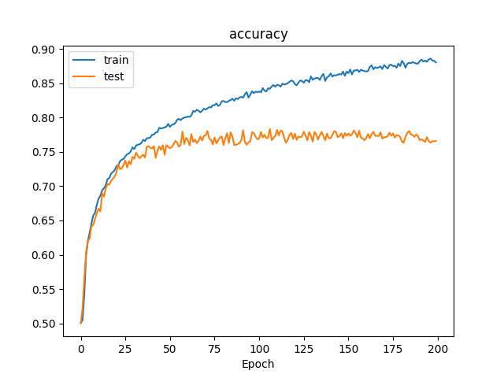
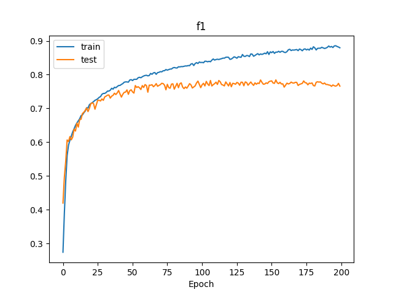

# climate-ai
Applied AI Essentials - Hive project in Climate AI

## Project Statement
Solar power will play a major role in a sustainable energy transition. The reliable operation of solar
power plants is critical both in terms of power system safety and economics. The use-case we aim to
solve here is to improve the operational performance of solar modules enabling focused maintenance
and improved efficiency. This is a multi-classification problem using infrared images where we aim to
classify whether a given image belongs to the healthy category or one of the unhealthy ones. 

## CNN Model

Model: "sequential"
Layers:
 - Conv2D (64)
 - MaxPooling2D
 - Conv2D (128)
 - MaxPooling2D
 - Conv2D (256)
 - MaxPooling2D
 - Flatten
 - Dense (512)
 - Dropout
 - Dense (12)

