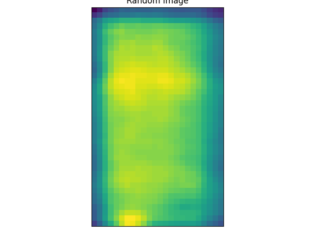
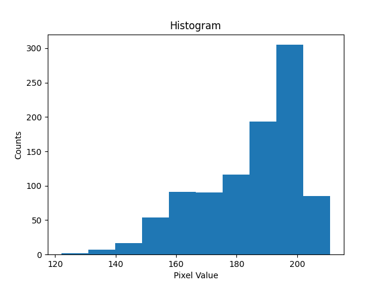
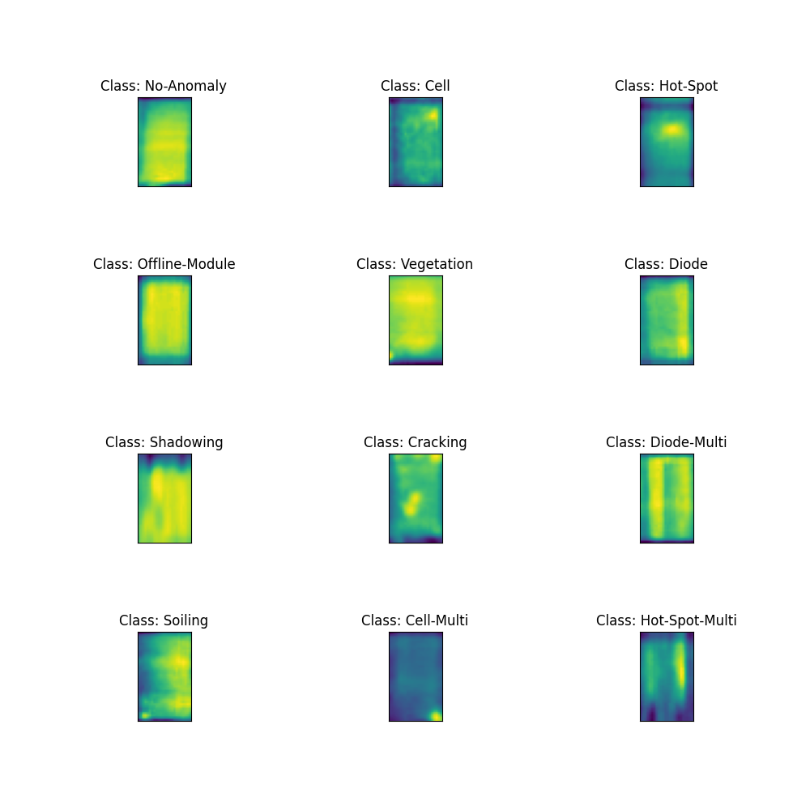

Overview
========

Number of images: 19903

Number of unique classes: 12

Class names:
- No-Anomaly
- Cell
- Hot-Spot
- Offline-Module
- Vegetation
- Diode
- Shadowing
- Cracking
- Diode-Multi
- Soiling
- Cell-Multi
- Hot-Spot-Multi

Number of images per class: 
- No-Anomaly: 9971
- Cell: 1865
- Vegetation: 1638
- Diode: 1498
- Cell-Multi: 1278
- Shadowing: 1055
- Cracking: 925
- Offline-Module: 822
- Hot-Spot-Multi: 239
- Hot-Spot: 239
- Soiling: 200
- Diode-Multi: 173

Image shape: (40, 24)

Mean Image shape: (40.0, 24.0)

